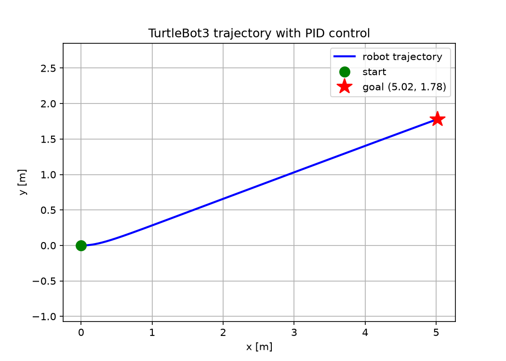
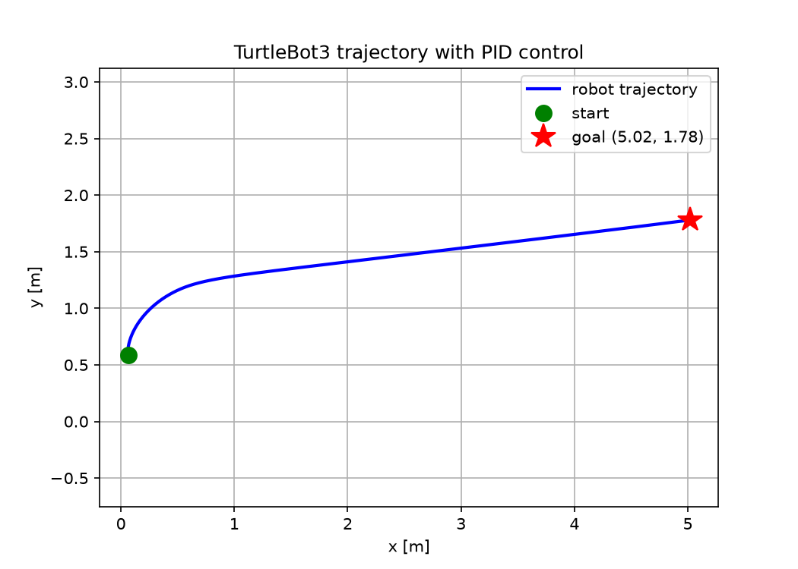

# Lab 1: PID control of TurtleBot3

`turtlebot_pid` is a ROS 2 Humble package that drives a TurtleBot3 Burger in Gazebo
to the goal (5.02, 1.78) using PID control on distance and heading error.
It reads `/odom`, publishes `/cmd_vel` at 10 Hz and stops within 2 cm of the goal.

Gains used in `pid_node.py`:

- Distance: Kp = 0.30, Ki = 0.01, Kd = 0.05
- Heading: Kp = 1.00, Ki = 0.01, Kd = 0.10
- v limited to [0, 0.2] m/s, w limited to [-0.2, 0.2] rad/s

## Build

```bash
cd ~/ros2_ws
source /opt/ros/humble/setup.bash
colcon build --packages-select turtlebot_pid
source install/setup.bash
```

## Run

```bash
# terminal 1
export TURTLEBOT3_MODEL=burger
ros2 launch turtlebot3_gazebo empty_world.launch.py

# terminal 2
python3 ~/ros2_ws/src/cp241_alnc_iisc/lab1_pid/turtlebot_pid/turtlebot_pid/plot_trajectory.py

# terminal 3
ros2 run turtlebot_pid pid_node
```

After `GOAL REACHED!`, press Ctrl+C in terminal 2. The plot is saved to `~/trajectory.png`.
Pressing Ctrl+C in terminal 3 at any time stops the robot.

To use another goal, pass it to both scripts:

```bash
python3 ~/ros2_ws/src/cp241_alnc_iisc/lab1_pid/turtlebot_pid/turtlebot_pid/plot_trajectory.py --ros-args -p xd:=-2.0 -p yd:=1.0
ros2 run turtlebot_pid pid_node --ros-args -p xd:=-2.0 -p yd:=1.0
```

To test from a different start pose, restart Gazebo and move the robot first:

```bash
timeout 6 ros2 topic pub -r 10 /cmd_vel geometry_msgs/msg/Twist "{linear: {x: 0.15}, angular: {z: 0.5}}"
ros2 topic pub --once /cmd_vel geometry_msgs/msg/Twist "{}"
```

## Results

Start at origin:



Arbitrary start:


